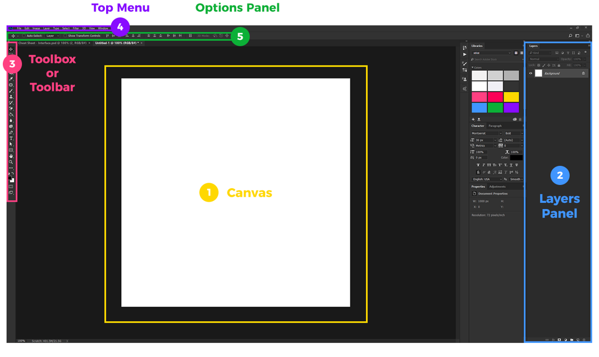
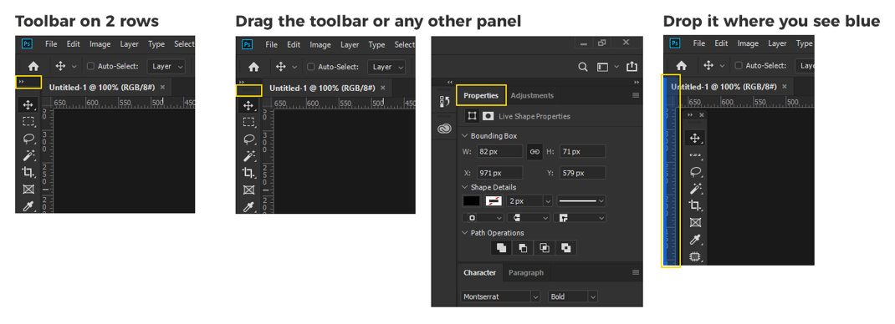
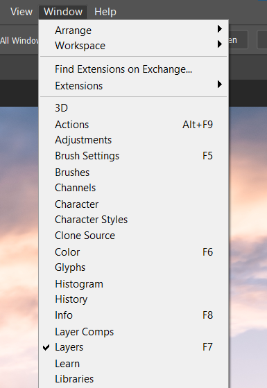
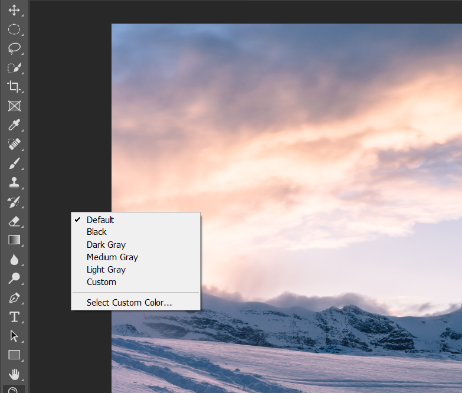
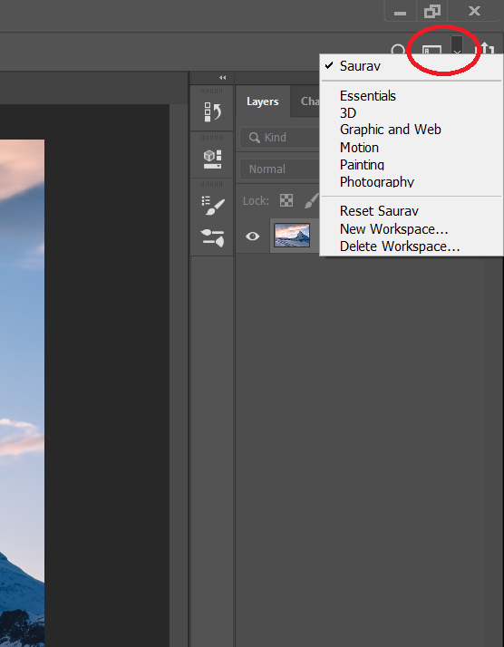
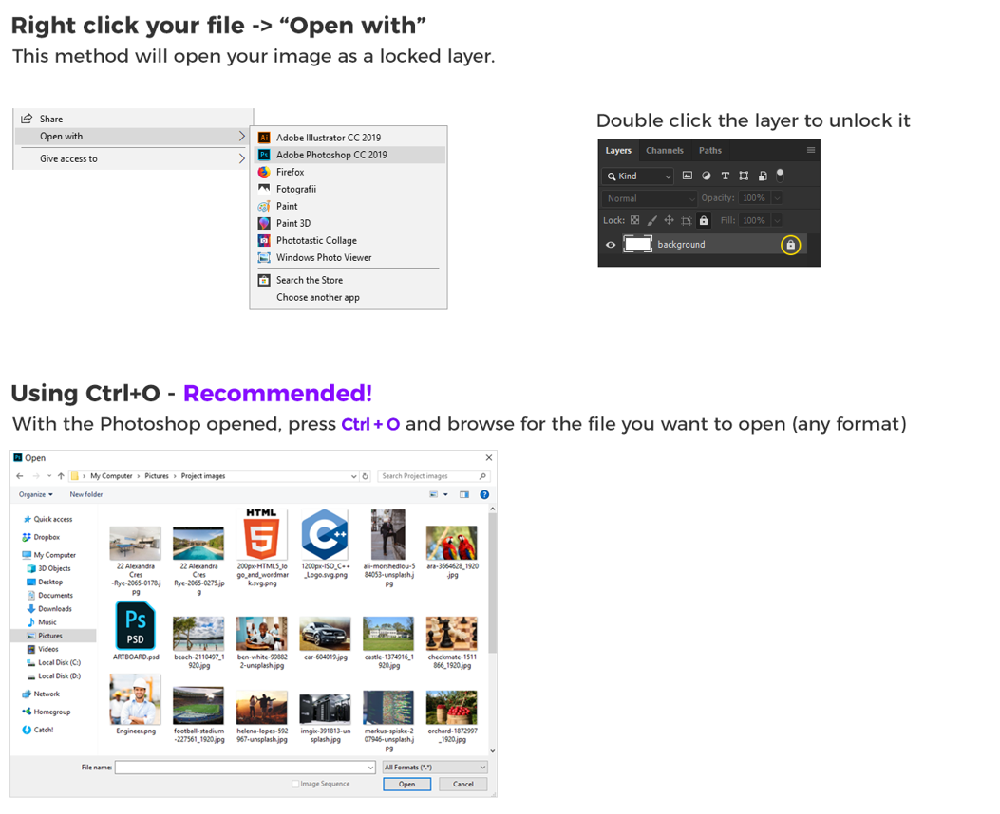
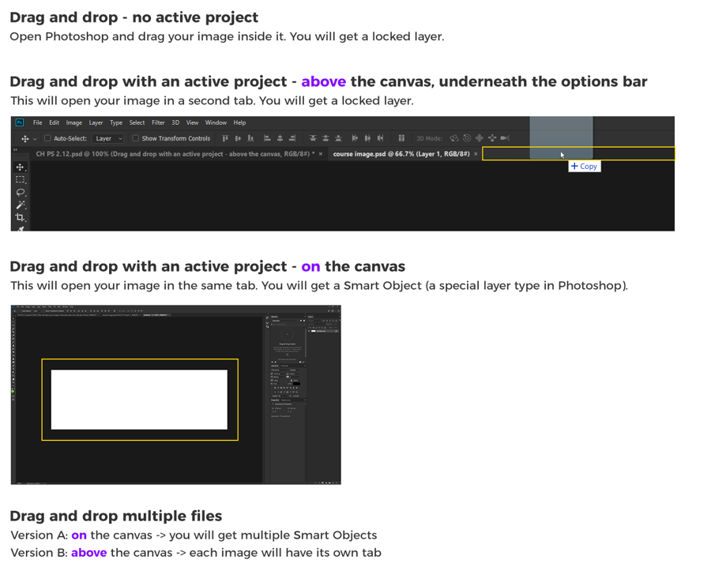
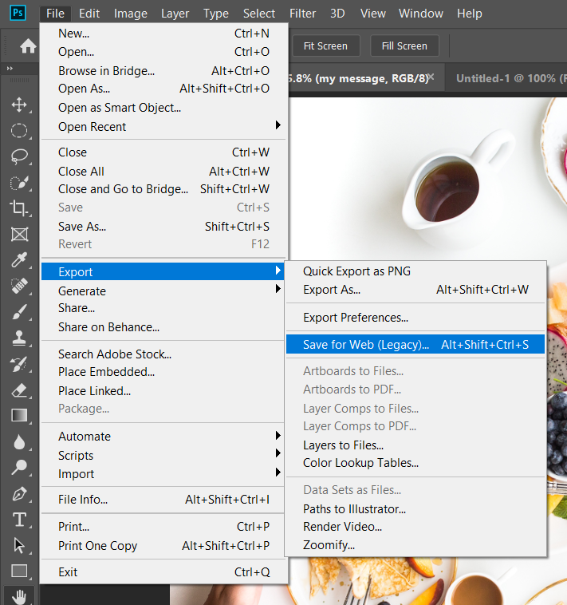
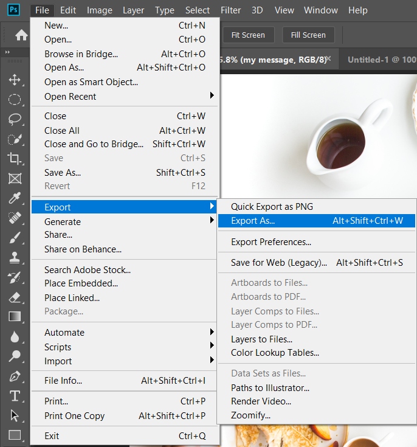
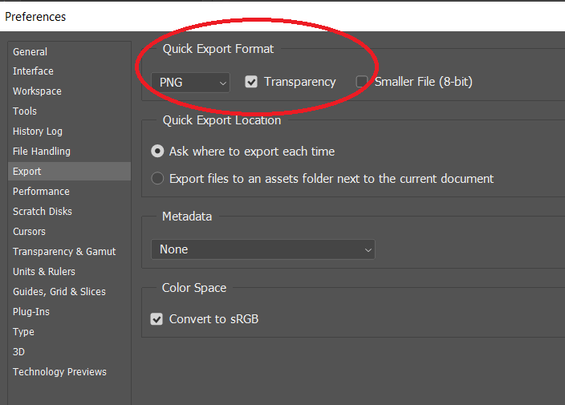

## Introduction

1. Photoshop Interface
2. Customize our workspace
3. 6 ways to open an image
4.  Ways to export your work

### 1. Photoshop Interface

#### Canvas

The most important is the central area called Canvas where everything happens. We draw,paint or design here . 90% we need to focus here.

#### Layer

Everything that happens on the canvas can be seen on the layers panel.

#### Toolbox

All the tools available for draw,paint or design. 90% of time these are accessed using hot keys.

#### Top Menu

It contains all sort of features

#### Option Panel

It changes every-time depending upon the tool we are using.

### 2. Customize our Interface

#### Color of the Program

Open the Preferences by pressing Ctrl+K. Then choose the theme according to your choice.

#### Customize your Workspace

#### Add other Panels

Go to the Top Menu and Navigate to Window.

#### Change workspace background

Right Click outside the canvas.

#### Save your workspace

To Save the workspace so that we don’t need to customize every-time we open Photoshop.

### 3. Open Images

### 4. Export Your Work

- 

- 

- **Go to Layer Panel and right click on any Layer and choose Quick Export. To change the default png . Go to preferences **

  

- **Go to Layer Panel and right click on any Layer and choose Export as to export particular Layer.**

