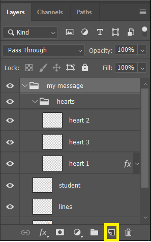
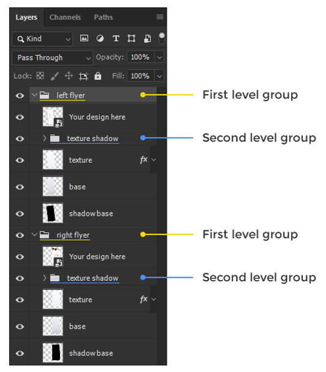
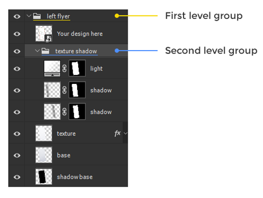
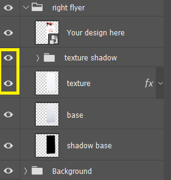
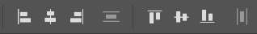
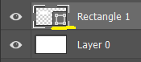
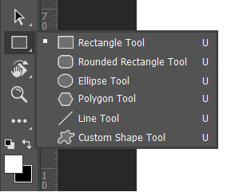
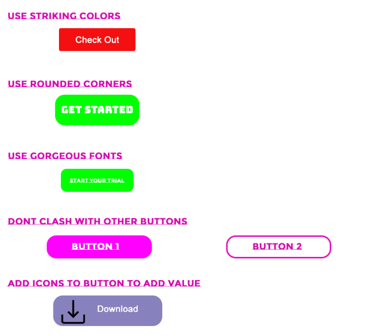
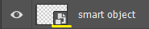
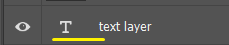

## Layers

- **Layers are transparent pieces of paper that stack on top of each other.**

- **Use the new layer button or Ctrl+Shift+N**

  

- **The order of layer is important**

- **Highlighted Layer are the active layer**

  

#### Group

Quick expand groups in Photoshop

A. Hold Ctrl it will expand first level groups but not the other ones.

​	

B. Hold Alt+Ctrl it will expand all groups, no matter how deep.

#### Layers Visibility

Hide or show a layer by using the eye icon next to it. You can hold the mouse click, go up & down to affect multiple layers.

#### Link Layers

Select any layers in the layer panel, right click and choose *Link Layers*. They will now move together.

#### Duplicate Layers

A. Use **Ctrl + J** to create copy

B. With the move tool selected, hold Alt and drag to create copy.

### Arrange Image Quickly

#### Helpful Guides

**A.** Smart Guides : View > Show > Smart Guides

**B.** Guides : Activate them through rulers: Ctrl + R. Drag them from left or top side of your screen. Hide them with Ctrl + ; and un/lock them with Ctrl+Alt+;

#### Alignment Tools

Require at least two selected layers or group and you must have move tool activated.

## Layers Types

### 1. Shape Layer

We can identify the layer to be shape layer by looking at the thumbnail of the layers.

The biggest advantage of the shape layer is their vector property. We can enlarge **(Ctrl + T)** it to the shape we need and it maintain it sharpness. But there is a disadvantage as it doesn’t allow editing.

​	Tools in shape layer :- 

​	

*Hold Shift and use the respective tool to draw in equal proportion.*

#### Design Web Buttons

1. Use Striking Colors

   - Choose a rectangle with radius 5px.
   - Change the background to red.
   - Type the text with desired font & style.
   - Align the text.

2. Use Rounded Corners

   - Choose a rectangle with radius 25px.
   - Change the background to green.
   - Type the text with desired font & style.
   - Align the text.

3. Use Gorgeous Fonts

   *Use Google Font to browse popular fonts.*

4. Dont Clash with Other Buttons

5. Add Icons to Button To Add Value

   - Download icons from flat icon.
   - Use Shift and arrows to move 10 pixel.

#### Use Custom Shapes

We can download shapes from [Click Me](http://www.shapes4free.com/). These shapes are vector so we can enlarge them accordingly.

### 2. Raster Layer

The most used layer in photoshop, it can be identified by looking at it thumbnail there is no additional icon.  It gives complete freedom to edit. But has a disadvantage it looses it quality on enlargement. 

### 3. Smart Object 

We can identify the layer to be shape layer by looking at the thumbnail of the layers. These are special layer which hold the pixel because it thinks the user might need the pixel later on so the picture doesn’t lose it quality again on enlargement. It isn’t directly editable. 

### 4. Text Layer

It is always editable. It can be rasterized but it isn’t preferred because it looses it editable quality. Text Layer have vector properties enlarge without worries.

