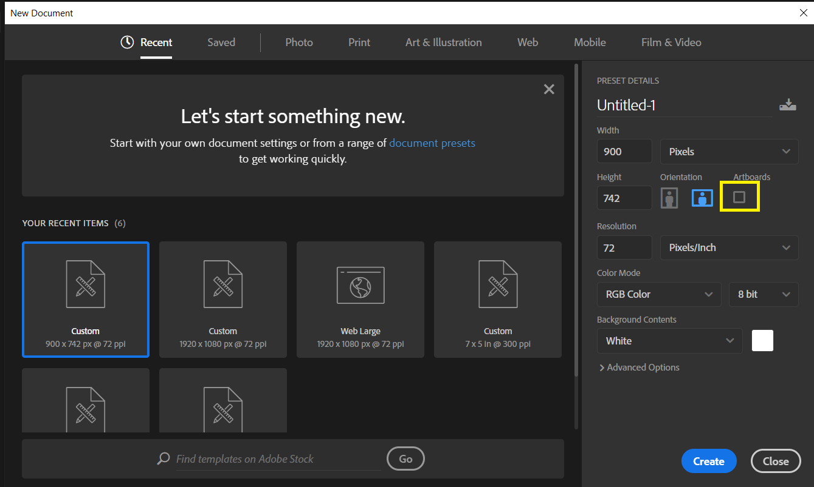
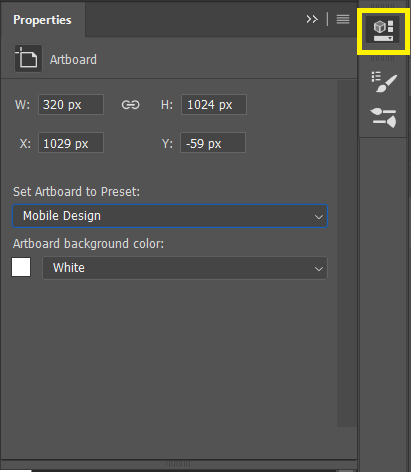

## Art-Boards

They are the mini canvas and can have multiple of them according to choice.

Suppose we are creating an app. It can have multiple screens. So in order to represent multiple screen we use artboard. 

Application	

- Android Project
- Web Project

#### How to create Art-Board ?

- Open Photoshop CC 2019
- Click on Create New or press hotkey Ctrl+N
- Tick the Art-Board Option

#### How to resize artboard ?

- Choose the artboard to resize by clicking on artboard name.

- Resize it by dragging around corners or using properties.

  

#### Exporting Artboards ?

- Alt + Ctrl + Shift + W
- Select Different Artboards then right click choose export as