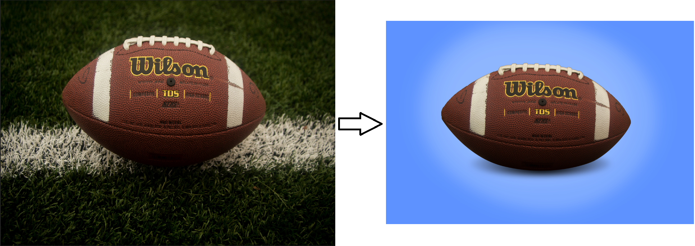
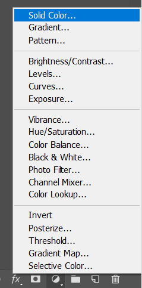
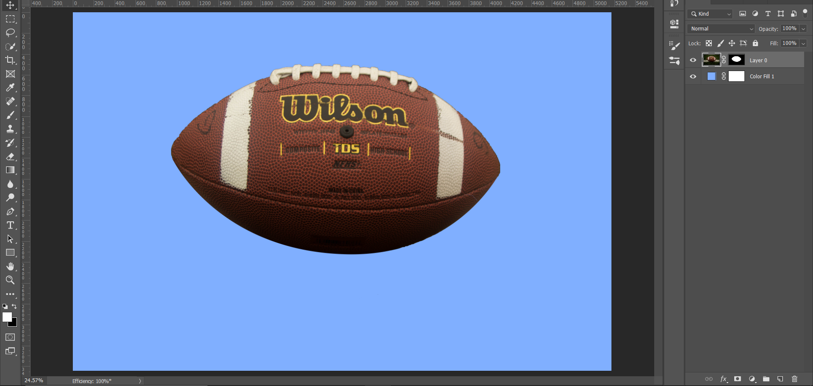
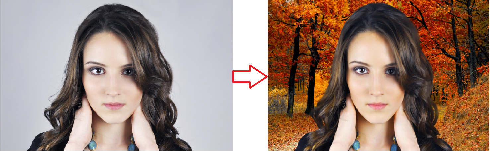

## Selection

It helps to isolate certain part of image in order to better focus on that area. It allows us to pin point where we want to work.

​	The ways of selection are :-

									1.	Marquees
									2.	Lassos
									3.	Quick Selection
									4.	Magic Wand
									5.	Pen Tool 

**Deselect : Ctrl + D**

### Marquee

On selecting Marquee, we can see that in option bar we have 4 options available.

- New Selection
- Add to Selection
- Subtract from Selection
- Intersect with Selection

| Keys                 | Function                             |
| -------------------- | ------------------------------------ |
| Shift                | Adds to an existing solution         |
| Alt                  | Subtracts from an existing solution  |
| Alt + Shift          | Intersects from an existing solution |
| Shift after dragging | Constrains Proportion                |
| Alt after dragging   | Grow Selection on Both Sides         |

#### Types of Marquee :

- Rectangular Marquee
- Elliptical Marquee

### Lassos

When we draw on canvas we can’t use shift key to create straight line. Here similar to Marquee Shift & ALT, add & remove.

- Lasso
- Polygonal
- Magnetic 

Use backspace to move a step back.

## Layer Mask

These are the pillar of non-destructive editing. Whenever we cant decide to remove the background or bring it back . So we depend on layer mask it gives us the choice to go henceforth.

After Clicking this Layer Mask Button a white square appears to layer thumbnail.

Click on this white box to enter layer mask. Where we can remove and undo the image.

#### Quick Selection Tool(W)

This act like a brush. You can click and drag over element. It goes on expanding. 

[ , ] is used to increase or decrease size.

Alt to subtract selection.

#### Magic Wand 

It’s underneath the Quick Selection. Use Shift + W to use magic wand. It is used when there is higher similarity. 

So we should decide which to use among them.

## Activities

### Remove Football Background

#### Steps

1. Choose Quick Selection and select the football.

   

   **Adjust the small mistakes using ALT to remove the extra selection.**

2. Choose Layer Mask to remove the layer.

   

3. Remove the extra corners selection using eraser. But a better option would be to use pen tool to maintain it roundness precisely. 

   

   After selection using pen tool. Right Click and choose make selection. Then Paint it with Black Brush to remove the outer region.

**Now we are all set. We need to adjust the background now for that we will use adjustment layer.**

​	

**After choosing the color we get this**

Now we need to place shadow. 

Select the ellipse tool and draw a ellipse to represent a shadow. Now make it blur specifically Gaussian Blur to look like shadow. Then use gradient tool to lighten it. The ellipse should have it layer mask to perform this.

The final output is 

### Remove Background & Mask Hair

#### Steps

1. Choose Quick Selection and select the girl.

2. Press the Select & Mask Button 

   

3. To deal with hair. In view mode we should choose the worst scenario view mode to solve our issues with selection. Choose On Layers -> Select Overlay -> Change the opacity to 100%.

   

   The result will be as shown below :- 

4. Grab the refine edge brush **(R)** and color around the white portion.

5. Choose On Layers -> Select On Layers. To remove the whitish portion choose Decontaminate colors.

   

   **Choose Ok and we get the output.**

    

