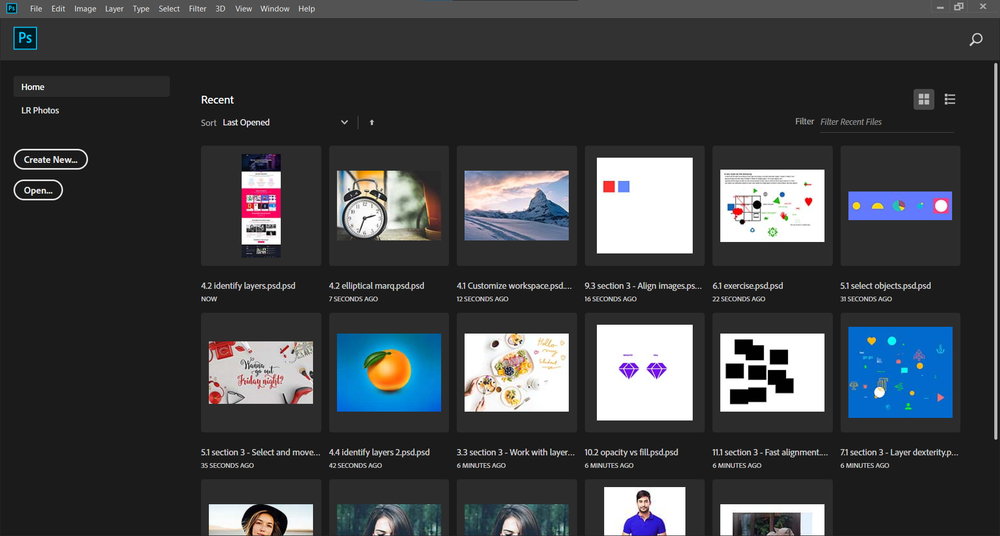
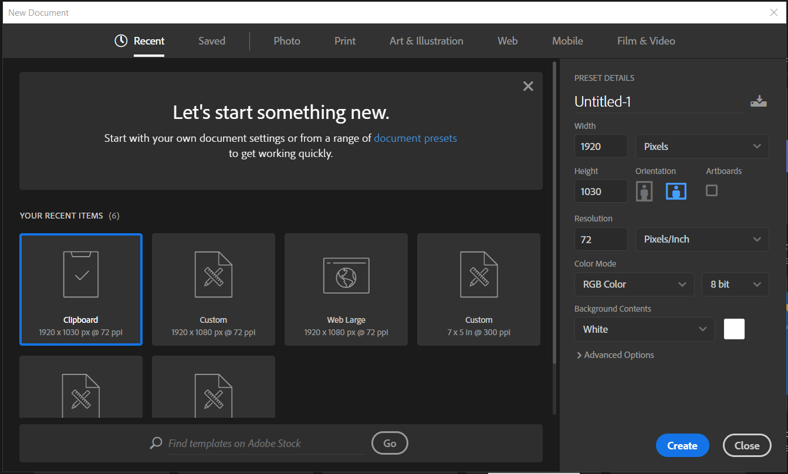

### Speed Up Photoshop

- Open Preferences (Ctrl + K)
- Choose Performance
- Choose the memory usage between 60-70% 
- Limit the History States below 30

### Create a new project

- Open Photoshop CC 2019

  

- Click on Create New or press hotkey Ctrl+N

  

- Move to Web Part. And choose the preset according to your size or give your own width & height. Click on create new.

#### To Export

File -> Export -> Save For Web Legacy

#### To Get History 

Window(Top Menu) -> History