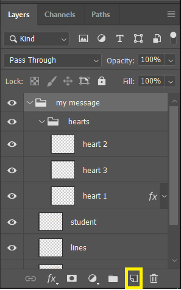
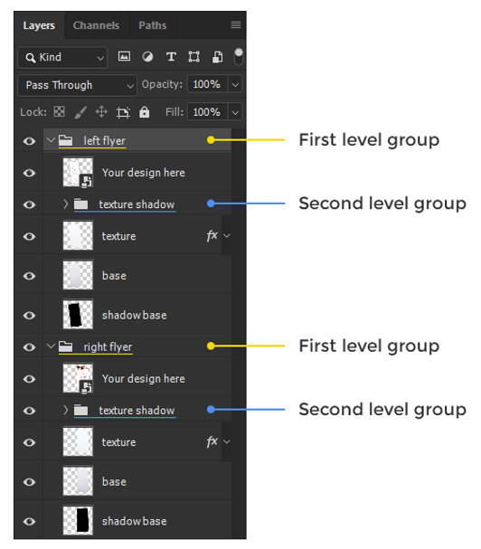
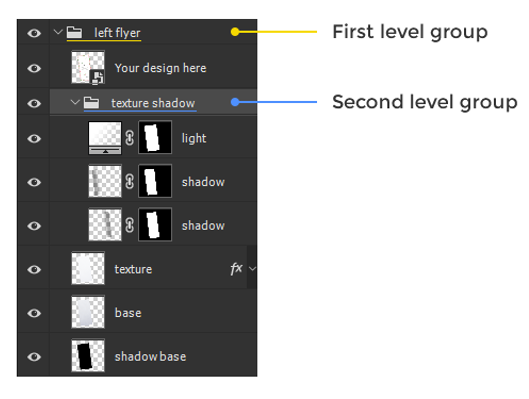
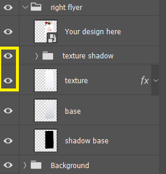

## Layers

- **Layers are transparent pieces of paper that stack on top of each other.**

- **Use the new layer button or Ctrl+Shift+N**

  

- **The order of layer is important**

- **Highlighted Layer are the active layer**

  

#### Group

Quick expand groups in Photoshop

A. Hold Ctrl it will expand first level groups but not the other ones.

​	

B. Hold Alt+Ctrl it will expand all groups, no matter how deep.

#### Layers Visibility

Hide or show a layer by using the eye icon next to it. You can hold the mouse click, go up & down to affect multiple layers.

#### Link Layers

Select any layers in the layer panel, right click and choose *Link Layers*. They will now move together.

#### Duplicate Layers

A. Use **Ctrl + J** to create copy

B. With the move tool selected, hold Alt and drag to create copy.

### Arrange Image Quickly

#### Helpful Guides

**A.** Smart Guides : View > Show > Smart Guides

**B.** Guides : Activate them through rulers: Ctrl + R. Drag them from left or top side of your screen. Hide them with Ctrl + ; and un/lock them with Ctrl+Alt+;

#### Alignment Tools

Require at least two selected layers or group and you must have move tool activated.

